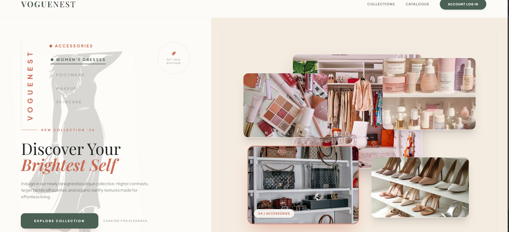
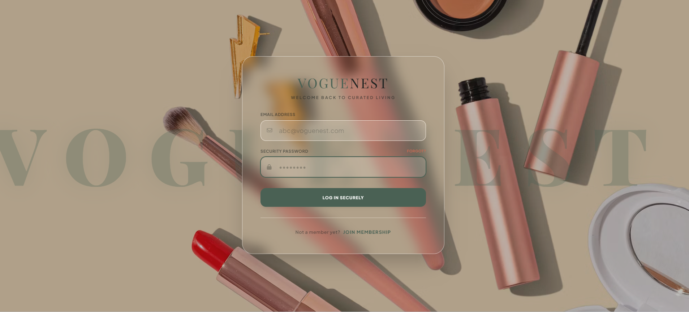
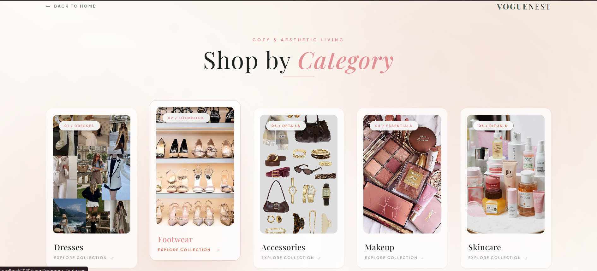
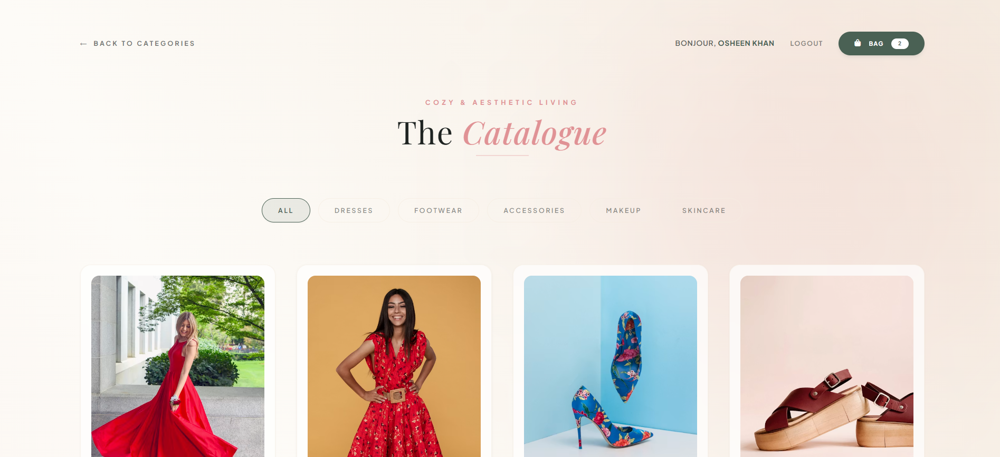
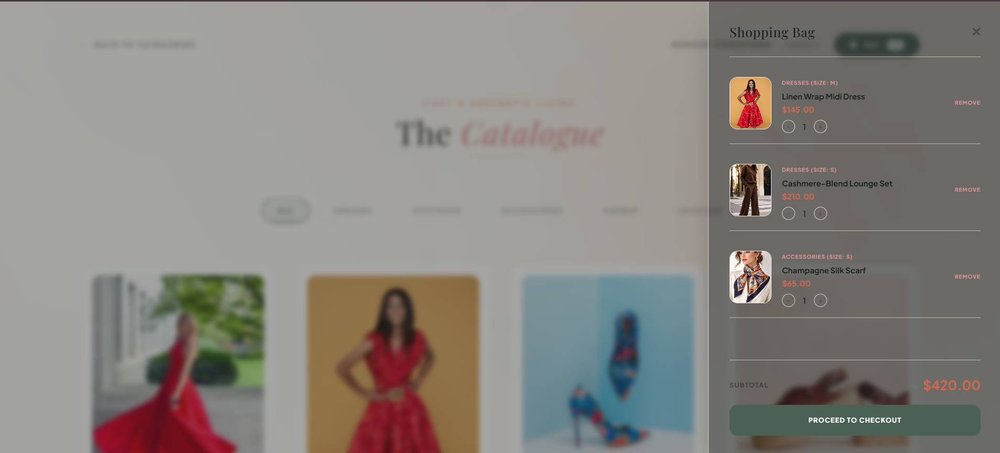
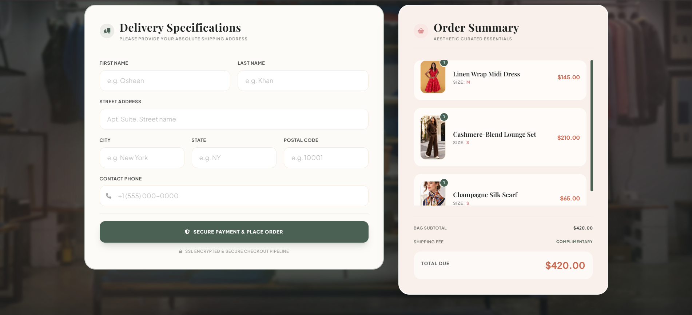
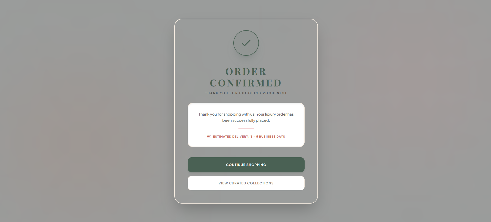

# 🌸 VogueNest — Premium Editorial Women's Fashion Store

## 📖 Project Overview

VogueNest is an editorial-grade, high-fashion e-commerce application designed for premium wardrobe curation and luxury lifestyle retail. Built with Spring Boot 3, Thymeleaf, and Hibernate/JPA, this platform fuses a cozy, minimalist pastel-sage visual design aesthetic with a robust, enterprise-standard backend architecture.

---
## 📸 Visual Storefront Walkthrough

Recruiters and developers can preview the high-fashion editorial-grade storefront layout immediately below without compiling the Java sources locally.

### 1. 🏡 Minimalist Editorial Landing Page

The entry point captures brand identity with asymmetric visual blocks, delicate serif headings, and high-contrast pastel terracotta highlights.

### 2. 🔑 Member & Admin Sign-In Card

Clean frosted-glass card design utilizing Spring session-based unified verification.

### 3. 🗺️ Curated Showcase Categories Page

Asymmetrical grid panel displaying product categories (Dresses, Footwear, Accessories, Makeup, Skincare) with modern viewport scaling.

### 4. 🛍️ Active Storefront Catalogue Page

Dynamic multi-category storefront displaying real-time JPA products, equipped with instant CSS Quick View trigger transitions.

### 5. 🛒 Storefront with Slide-over Cart Bag Drawer

Asynchronous cart slide-over panel managing responsive dynamic subtotal valuations.

### 6. 💳 Secure Checkout Specifications Slate

Complete shipping input forms matched beside persistent customer summary receipts with complementary luxury delivery metrics.

### 7. 🎉 Order Confirmed Success Medallion

SSL simulated order clearance landing panel with automated transactional cart flushing triggers.

---

## 🛠️ Technical Highlights & Architecture

### 1. 🎨 Curated Editorial Aesthetics

Visual Identity: Designed with a tailored pastel-cream background (#FDFBF7), organic forest sage accents (#4A6154), and bright terracotta coral anchors (#C96A53).

Typography & Motion: Clean serif typography (Playfair Display) paired with modern sans-serif fonts (Plus Jakarta Sans), utilizing smooth CSS transitions and dynamic viewport interactions.

### 2. 🔒 Secure Dual-Role Session Management

Dynamic Registration: Client onboarding with real-time backend duplicate email constraints.

Unified Authentication Routing: Implements role-based redirection logic. Upon successful login, standard customers are redirected back to their active session/checkout board, while verified Admins are automatically routed to the restricted inventory portal.

### 3. 👗 Multi-Category Storefront

Modular Showcase: Interactive 5-column grid layout (Dresses, Footwear, Accessories, Makeup, Skincare) featuring smooth viewport scaling, dynamic category counts, and hover-state transformation triggers.

### 4. 🚀 Hybrid Asynchronous Cart Sync Engine (MNC Standard)

Guest State Management: Guest users can seamlessly manage and modify shopping bags. Dynamic JSON payloads are captured and serialized utilizing HTML5 LocalStorage to prevent database bloating.

Asynchronous Database Sync: Upon successful user login, a JavaScript interceptor serialized payload is passed to the backend CartService, merging and persisting the client-side session array into the database.

### 5. ⚙️ Dynamic Admin Inventory Control

Secure Access Forms: Restricted catalog portal at /admin/add allows authenticated administrators to add metadata, descriptions, pricing structures, and media assets in real-time.

Externalized Configurations: Sensitive default admin profiles and credentials are fully externalized from Java source code using Spring Property Placeholders for top-tier GitHub code safety.

### 6. 📦 Secure Checkout Pipeline

Complimentary Shipping Engine: Dynamic shipping calculators featuring complimentary luxury delivery mappings.

Relational Cart Flushing: Automated transactional cascades flush and clear active database cart records upon successful simulated SSL checkout completions.

---

## 💻 Tech Stack & Core Libraries

Backend Engine: Java 21, Spring Boot 3 (Spring MVC, Spring Data JPA, Spring Security Core)

Frontend View: HTML5, CSS3, Thymeleaf Templating Engine, Tailwind CSS (Custom Pastel Palette Configurations)

Database Management: Persistent MySQL / H2 In-Memory Database (Configured with dynamic fallback configurations)

Build Engine: Apache Maven

API Testing & Architecture: Postman Client (Schema validations, serialization checks, and raw JSON parsing)

---

## 🏢 Enterprise Project Packaging Structure

The architecture strictly decouples presentation, business logic, and persistence layers according to the Twelve-Factor App methodology:

src/main/
├── java/com/Osheen/VogueNest/
│   ├── component/
│   │   └── DataInitializer.java        # Automated startup database catalog seeder
│   ├── controller/
│   │   ├── AuthController.java         # Directs login, registration, and cart syncing
│   │   ├── CartController.java         # Traditional Spring MVC form submissions
│   │   ├── CartRestController.java     # Asynchronous REST APIs for live AJAX operations
│   │   ├── CheckoutController.java     # Manages checkout pipeline and order states
│   │   ├── ProductController.java      # Serves shop catalog and admin product forms
│   │   └── SiteController.java         # Serves high-fashion landing page
│   ├── model/
│   │   ├── Cart.java                   # Relational persistent cart schema
│   │   ├── Product.java                # Catalog merchandise schema (Defensive JSON Ignore)
│   │   └── User.java                   # Member/Admin profile credentials
│   ├── repository/
│   │   ├── CartRepository.java         # Custom optimized bulk delete and fetch queries
│   │   ├── ProductRepository.java      # Case-insensitive category filters
│   │   └── UserRepository.java         # Unique email lookup persistence
│   ├── service/
│   │   ├── CartService.java            # Cart orchestration blueprints
│   │   ├── ProductService.java         # Product catalog contract models
│   │   ├── UserService.java            # Authentication logic contracts
│   │   └── impl/
│   │       ├── CartServiceImpl.java    # Asynchronous parsing & sync algorithms
│   │       ├── ProductServiceImpl.java # Safe inventory transaction management
│   │       └── UserServiceImpl.java    # Plaintext/Dynamic verification layer
│   └── VogueNestApplication.java       # Main entry point (excludes Security configuration on startup)
└── resources/
├── static/
│   └── images/                     # Premium media lookbook assets
├── templates/                      # Server-side Thymeleaf visual layers
│   ├── add-product.html            # Pastel Admin addition portal
│   ├── categories.html             # Curated showcase list
│   ├── checkout.html               # Luxury secure checkout slate
│   ├── landingpage.html            # Minimalist editorial greeting screen
│   ├── login.html                  # Member & Admin sign-in card
│   ├── order-success.html          # Order confirmed success medallion
│   ├── shop.html                   # Core storefront with dynamic slide-over bag
│   └── signup.html                 # Join membership onboarding card
└── application.properties          # Dynamic port binding and externalized environment configs

⚡ How to Run Locally

Prerequisites

Java Development Kit (JDK 21)

Maven 3.8+

IntelliJ IDEA (Ultimate or Community Edition)

Setup Steps

Clone the repository:

git clone https://github.com/osheenkhan1031/VogueNest.git
cd VogueNest

Database Fallback Check:
Open src/main/resources/application.properties. If no environment variables are present, the database gracefully defaults to a local H2 / MySQL schema. If you run your local MySQL service, configure the password property to match your native database credentials.

Compile and Boot the Server:

mvn clean spring-boot:run

Access the Application:
Open http://localhost:8080 on any web browser.

🗺️ Future Scope & Roadmap

To scale VogueNest into a market-ready production system, the following integrations are scheduled in the next developmental sprint:

🔑 Spring Security & OAuth2 Integration: JWT-based token authorization for stateless API security, "Sign In with Google/Apple" federated authentication, and Bcrypt cryptographic hashing for password salting.

💳 Real-time Payment Gateway Integration: Connecting to Razorpay / Stripe Webhook APIs for live secure payment handshakes, handling multi-currency settlements, and generating instant commercial invoices.

☁️ AWS S3 / Cloudinary Media Pipeline: Moving local static assets to secure cloud object storage (S3) for CDN-backed high-speed media delivery.

✉️ Spring Boot Mailer Service: Automating transactional email triggers (Order Confirmed invoices, shipping tracking maps, and promotional newsletters) via SMTP services.

👤 Author

Osheen — Aspiring Software Engineer

Email: osheenk66@gmail.com

LinkedIn: [osheenkhan1031](https://linkedin.com/in/osheenkhan1031)
